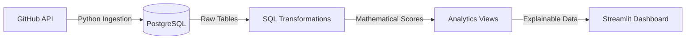

# GitHub Data Pipeline & Portfolio Analyzer

A complete, end-to-end Data Engineering pipeline that automatically ingests GitHub repository data, applies a mathematical scoring algorithm to rank projects, and presents the results in an explainable, decision-support dashboard.

## 🎯 The Problem
Selecting meaningful projects for a software engineering portfolio is highly subjective and often inconsistent. Developers struggle to objectively identify which of their repositories demonstrate the strongest signals of recency, activity, and presentation.

## 💡 The Solution
I built an idempotent data pipeline that ingests raw GitHub API data, loads it into a PostgreSQL warehouse, and uses pure SQL transformations to score and rank projects based on an exponential decay algorithm. The system separates objective data gathering from subjective curation.

## 🏗️ Architecture



1. **Ingestion Layer (`src/`)**: A custom Python GitHub client that handles pagination, dynamic rate-limiting, and idempotently UPSERTs data into PostgreSQL.
2. **Storage Layer (`sql/schema.sql`)**: A relational schema storing raw commits, repository metadata, and pipeline execution logs.
3. **Transformation Layer (`sql/transform.sql`)**: A pure SQL engine computing 0-100 component scores. Recency uses a true natural-log (`ln(2)`) 365-day half-life decay.
4. **Analytics Layer (`sql/analytics_views.sql`)**: Separates immutable system data from subjective product logic, using PostgreSQL Window functions (`PERCENT_RANK()`) to dynamically categorize "Hidden Gems".
5. **Presentation Layer (`dashboard/app.py`)**: A Streamlit dashboard utilizing "Progressive Disclosure" UX—showing recruiters a clean leaderboard while allowing engineering managers to drill down into the exact pipeline math.

## 🛠️ Tech Stack
* **Language:** Python 3.9
* **Database:** PostgreSQL
* **Data Processing:** Pandas, SQLAlchemy, Pure SQL
* **Frontend:** Streamlit

## 🚀 How to Run Locally

**1. Setup Environment**
```bash
python -m venv .venv
source .venv/bin/activate
pip install -r requirements.txt
```

**2. Configure Database & Secrets**
Create a `.env` file in the root directory:
```
GITHUB_TOKEN=your_personal_access_token
DB_NAME=github_db
DB_USER=postgres
DB_PASSWORD=your_password
DB_HOST=localhost
DB_PORT=5432
```

**3. Initialize Database**
```bash
psql -h localhost -U postgres -d github_db -f sql/schema.sql
```

**4. Run Pipeline (Ingest & Transform)**
```bash
python src/ingest.py
psql -h localhost -U postgres -d github_db -f sql/transform.sql
psql -h localhost -U postgres -d github_db -f sql/analytics_views.sql
```

**5. Launch Dashboard**
```bash
streamlit run dashboard/app.py
```

## 🔮 Future Roadmap (Version 2.0)
The next evolution of this project is transforming it into an Open Source Portfolio Builder. Version 2.0 introduces the **Curation Layer**, bringing database overrides directly into the Streamlit UI so external developers can manually categorize projects (System vs Practice) without touching SQL.
